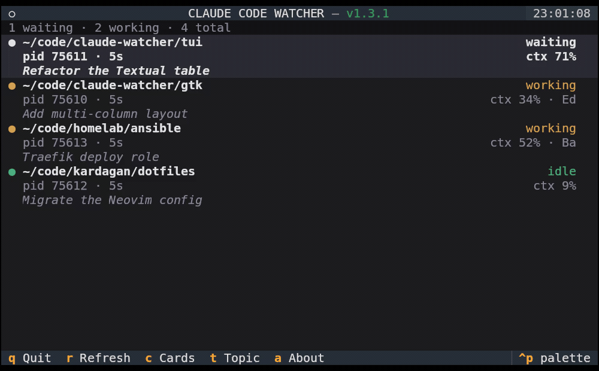

# Claude Code Watcher — TUI

> [Version française](README_FR.md)

A terminal UI (Textual) that monitors all running Claude Code sessions on your machine in a live table — keyboard-driven, runs anywhere a terminal does.

<p align="center">
  
</p>

## Features

- Detects all active Claude Code sessions automatically
- Shows each session's status in **real time**:
  - **Waiting** (orange) — Claude replied, waiting for your input
  - **Working** (amber) — Claude is processing your message, with tool name
  - **Idle** (green) — session paused
- Context window usage (`ctx%`) shown when available
- Optional **sort by idle time** (`s`) — most-recently-idle sessions on top
- Optional **idle duration** (`i`) on idle rows — approx (`02:24`, minute res) or precise (`02:24:23`)
- Git **worktree** sessions resolved to their real project, tagged `↳ WT: <name>`
- Press `Enter`/`Space` or click a row to focus the session's terminal window (click can be turned off in Settings)
- Cards mode (`c`) for a more spacious layout
- Header shows the installed version with an update indicator (green = up to date, red = a newer release is available)
- **Settings screen** (`p`) — pick the language and toggle every display option in one place (also persisted)
- Language auto-detected from system locale (`fr` / `en`), changeable any time in the settings screen

## Requirements

- Python 3.11+
- [`uv`](https://github.com/astral-sh/uv) (auto-installed by the installer if missing)
- `wmctrl` and `xdotool` for terminal focus

## Install

```bash
curl -fsSL https://github.com/claude-watcher/tui/releases/latest/download/install.sh | bash
```

Pin a specific version instead of the latest:

```bash
curl -fsSL https://github.com/claude-watcher/tui/releases/download/v1.3.1/install.sh | bash
```

To **upgrade**, just re-run the `latest` one-liner.

The installer will:
1. Install `uv` if missing, check for `wmctrl`/`xdotool`
2. Download the script to `~/.local/bin/claude-watcher-tui`
3. Set your language (prompted when run in a terminal; `CW_LANG=fr|en` otherwise)
4. Write `~/.config/claude-watcher/config.ini` (shared config, skipped if it already exists)

<details>
<summary>From a local clone (development)</summary>

```bash
git clone https://github.com/claude-watcher/tui
cd tui
./install.sh          # installs the checked-out script, no download
```
</details>

> **No hook to install:** status comes from Claude Code's own session files —
> nothing is added to `settings.json`.

## Usage

```bash
uv run ~/.local/bin/claude-watcher-tui
```

> **Not on your `PATH`?** `~/.local/bin` is on `PATH` by default on most distros,
> but not all. If the command isn't found, add this to `~/.profile` (or your shell
> rc) and re-login:
> ```bash
> export PATH="$PATH:$HOME/.local/bin"
> ```

### Keys

| Key | Action |
|-----|--------|
| `↑` / `↓` | Navigate sessions |
| `Enter` / `Space` / click | Focus session's terminal (click-to-focus can be disabled in Settings) |
| `p` | **Settings** — language + display options (apply & save instantly) |
| `k` | Close the selected session (idle only) — confirm, then sends `SIGTERM` |
| `a` | About / update info |
| `q` | Quit |
| `c` `t` `h` `s` `i` | Quick toggles (also in Settings): cards · topic · tooltip · sort · idle duration |

### CLI flags

```
--lang fr|en        force language (default: auto-detected)
--refresh-ms MS     refresh interval (default: 2000)
--once              print sessions as plain text and exit (debug/scripting)
--cards             start in cards layout
--no-topic          hide the per-session topic line (toggle live with 't')
--no-hover          disable the hover tooltip (toggle live with 'h')
--no-click-focus    clicking a row no longer focuses its terminal (Enter/Space still do)
--sort default|idle sort order (default: default; toggle live with 's')
--idle-format none|loose|precise  idle duration on idle rows (default: none; cycle live with 'i')
```

## How it works

For the technical details — session detection, click-to-focus internals, the
config file format, and known limitations — see [`doc/ARCHITECTURE.md`](doc/ARCHITECTURE.md).
