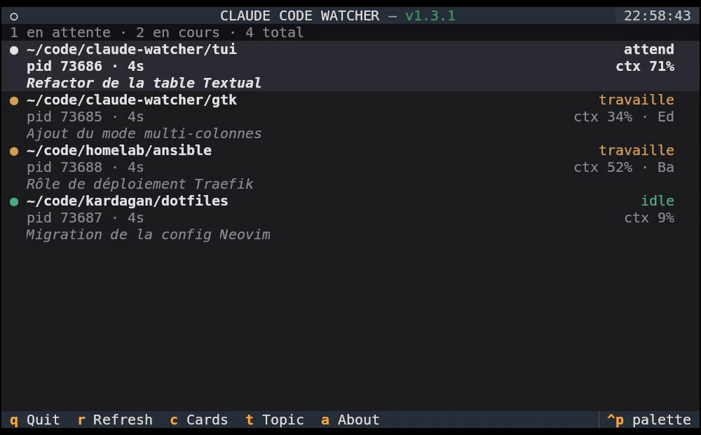

# Claude Code Watcher — TUI

> [English version](README.md)

Une interface terminal (Textual) qui surveille toutes les sessions Claude Code actives sur la machine dans un tableau en temps réel — entièrement au clavier, fonctionne dans n'importe quel terminal.

<p align="center">
  
</p>

## Fonctionnalités

- Détecte automatiquement toutes les sessions Claude Code actives
- Affiche l'état de chaque session en **temps réel** :
  - **Attente** (orange) — Claude a répondu, attend votre saisie
  - **Travaille** (amber) — Claude traite votre message, avec le nom de l'outil
  - **Idle** (vert) — session en pause
- Utilisation du contexte (`ctx%`) affichée si disponible
- Nombre de **sous-agents** lancés par session (`N agents`), chacun détaillé dans l'infobulle de la ligne — désactivable dans les Réglages
- **Démon** de fond affiché en ligne `(D)` non-focusable (masquable dans les Réglages)
- **Tri par inactivité** optionnel (`s`) — sessions les plus récemment inactives en tête
- **Durée d'inactivité** optionnelle (`i`) sur les lignes idle — approx. (`02:24`, résolution minute) ou précise (`02:24:23`)
- Sessions en **worktree** Git rattachées à leur vrai projet, étiquetées `↳ WT: <nom>`
- `Entrée`/`Espace` ou clic sur une ligne pour focus le terminal de la session (le clic est désactivable dans les Réglages)
- Mode cartes (`c`) pour un affichage plus aéré
- En-tête affichant la version installée avec un indicateur de mise à jour (vert = à jour, rouge = une nouvelle version disponible)
- **Fenêtre de réglages** (`p`) — choix de la langue et de toutes les options d'affichage au même endroit (persistées)
- Langue auto-détectée depuis la locale système (`fr` / `en`), modifiable à tout moment dans les réglages

## Prérequis

- Python 3.11+
- [`uv`](https://github.com/astral-sh/uv) (installé automatiquement si absent)
- `wmctrl` et `xdotool` pour le focus terminal

## Installation

```bash
curl -fsSL https://github.com/claude-watcher/tui/releases/latest/download/install.sh | bash
```

Épingler une version précise plutôt que la dernière :

```bash
curl -fsSL https://github.com/claude-watcher/tui/releases/download/v1.3.1/install.sh | bash
```

Pour **monter de version**, relance simplement la commande `latest`.

L'installateur :
1. Installe `uv` si absent, vérifie `wmctrl`/`xdotool`
2. Télécharge le script dans `~/.local/bin/claude-watcher-tui`
3. Crée `~/.config/claude-watcher/config.ini` (config partagée, ignorée si déjà présente)

La langue est auto-détectée depuis la locale système, puis modifiable dans la fenêtre de réglages (`p`) ou dans `config.ini`.

<details>
<summary>Depuis un clone local (développement)</summary>

```bash
git clone https://github.com/claude-watcher/tui
cd tui
./install.sh          # installe le script du clone, sans téléchargement
```
</details>

> **Aucun hook à installer :** l'état provient des fichiers de session propres à
> Claude Code — rien n'est ajouté à `settings.json`.

## Utilisation

```bash
uv run ~/.local/bin/claude-watcher-tui
```

> **Pas dans votre `PATH` ?** `~/.local/bin` est dans le `PATH` par défaut sur la
> plupart des distributions, mais pas toutes. Si la commande est introuvable,
> ajoutez ceci à `~/.profile` (ou au rc de votre shell) puis reconnectez-vous :
> ```bash
> export PATH="$PATH:$HOME/.local/bin"
> ```

### Raccourcis clavier

| Touche | Action |
|--------|--------|
| `↑` / `↓` | Naviguer entre les sessions |
| `Entrée` / `Espace` / clic | Focus le terminal de la session (focus au clic désactivable dans les Réglages) |
| `p` | **Réglages** — langue + options d'affichage (appliqués et enregistrés aussitôt) |
| `k` | Fermer la session sélectionnée (inactive uniquement) — confirmation, puis `SIGTERM` |
| `a` | À propos / infos de mise à jour |
| `q` | Quitter |
| `c` `t` `h` `s` `i` | Bascules rapides (aussi dans les Réglages) : cartes · sujet · infobulle · tri · inactivité |

### Options CLI

```
--lang fr|en        forcer la langue (défaut : auto-détectée)
--refresh-ms MS     intervalle de rafraîchissement (défaut : 2000)
--once              afficher les sessions en texte brut et quitter (debug)
--cards             démarrer en mode cartes
--no-topic          masque le sujet de session sous chaque ligne (bascule avec « t »)
--no-agents         masque le compteur de sous-agents lancés par session
--hide-daemons      masque les lignes du démon Claude Code (balisées (D))
--no-hover          désactive l'infobulle de survol (bascule avec « h »)
--no-click-focus    le clic ne focalise plus le terminal (Entrée/Espace restent actifs)
--sort default|idle  ordre de tri (défaut : default ; bascule avec « s »)
--idle-format none|loose|precise  durée d'inactivité sur les lignes idle (défaut : none ; cycle avec « i »)
```

## Comment ça marche

Pour les détails techniques — détection des sessions, internals du focus au clic,
format du fichier de config et limitations connues — voir
[`doc/ARCHITECTURE.md`](doc/ARCHITECTURE.md) (en anglais).
